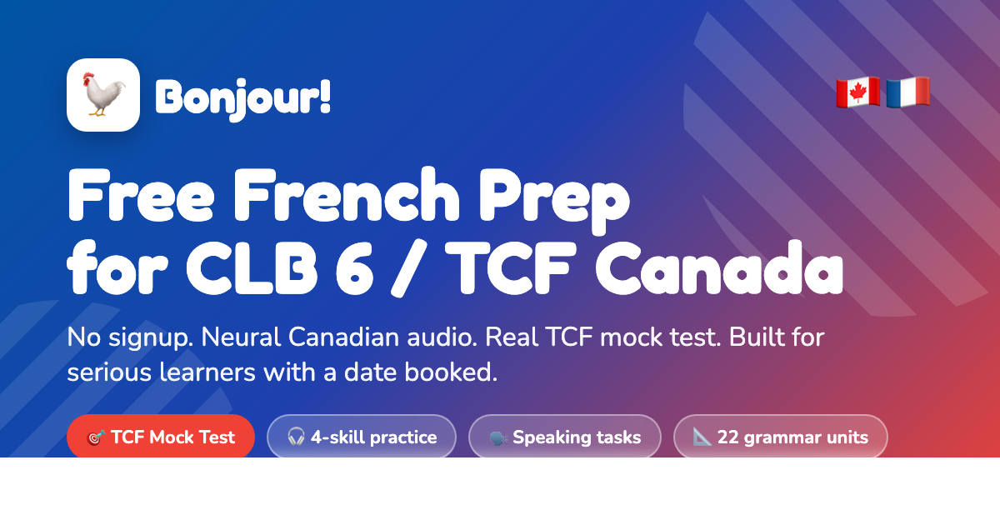

# Bonjour! — Free French learning for NCLC/CLB 6

[](https://frenchclb6.ca)
[](LICENSE)
[](https://frenchclb6.ca)

**Bonjour!** is a free, privacy-first French learning web app for people
working toward **NCLC/CLB 6** across listening, speaking, reading, and writing,
including preparation for **TCF Canada** and **TEF Canada**.

[Use the live course](https://frenchclb6.ca) ·
[Report a problem](https://github.com/arthikm21/learn-french-clb6/issues) ·
[Contribute](CONTRIBUTING.md)



## Why this project exists

Learners preparing for Canadian immigration, federal employment, or another
Canadian language requirement often have to combine generic language apps,
fragmented exam advice, and paid preparation products. Bonjour! brings the
foundations, four-skill practice, and Canada-specific exam formats into one
structured path.

The core course is available without creating an account. Progress stays in
the learner's browser, and recorded speaking practice remains on the device.
There are no behavioural analytics in the learning app.

Bonjour! does not promise that a learner will reach a benchmark within a fixed
period. Readiness depends on starting level, consistency, feedback, and
authentic practice outside the app.

## What learners can practise

| Area | Included practice |
|---|---|
| Pronunciation | Phonics, minimal pairs, Canadian French neural audio, and browser speech fallback |
| Vocabulary | SM-2 spaced-repetition flashcards across 10 themed decks |
| Grammar | 29 units from A1 to B1, with rules, examples, quizzes, and explanations |
| Listening | Dictation, graded comprehension, and answer explanations |
| Speaking | Shadowing, local recording, task rehearsal, pronunciation support, and self-review |
| Reading | Graded texts and multiple-choice comprehension |
| Writing | Models, original prompts, slip scans, and structured self-review |
| Exam preparation | Four-skill TCF Canada guides, score conversion, mock practice, TEF guidance, and weak-area review |
| Scenarios | 50 bilingual dialogues based on everyday situations in Canada |
| Games | Gender Sort, Conjugation Race, Sentence Builder, and Memory Match |

The curriculum is arranged as an eight-phase path from foundations through
NCLC/CLB 6 practice, with gate quizzes between phases.

## Design principles

- **Pattern before terminology:** learners encounter audio, examples, and
  visuals before a formal grammar explanation.
- **Explain the answer:** practice should show why an answer works, not only
  whether it was correct.
- **Four-skill accountability:** the path includes productive speaking and
  writing tasks as well as recognition exercises.
- **Privacy by default:** progress uses `localStorage`; microphone recordings
  are handled locally and are not uploaded by the application.
- **Accessible and resilient:** keyboard support, readable contrast, offline
  behaviour, and low-friction static deployment are treated as core features.

## Technology

- Pure HTML, CSS, and JavaScript; no application framework or build step.
- Pre-generated Canadian French neural MP3s with browser speech-synthesis
  fallback.
- Browser `MediaRecorder` for local speaking practice.
- `localStorage` for learning progress, with backup and restore.
- Static deployment with offline PWA support.
- Node.js scripts for local preview, validation, tests, and media tooling.

## Run locally

Requirements: Node.js 20 or newer.

```bash
git clone https://github.com/arthikm21/learn-french-clb6.git
cd learn-french-clb6
npm start
```

Open <http://localhost:8765>. To choose a different port:

```bash
PORT=8000 npm start
```

Recorded speaking tasks require a modern browser and microphone permission.
Shadowing works without a microphone.

## Validate the project

```bash
npm test
npm run check
```

The complete check runs syntax validation, content validation, and the test
suite.

## Deploy

Production is connected to Cloudflare Pages. Pushing `main` deploys the static
site to [frenchclb6.ca](https://frenchclb6.ca). The `_headers` file and service
worker contain the current production-oriented configuration.

## Project status and roadmap

Bonjour! is actively maintained. Near-term priorities include:

- Broader automated accessibility and cross-browser coverage.
- More original TCF and TEF practice sets with answer rationales.
- Stronger speaking and writing feedback without compromising learner privacy.
- Clearer contributor tooling and smaller, reusable curriculum data modules.
- A structured pathway from NCLC/CLB 6 toward NCLC/CLB 7.

Ideas and bug reports are welcome in
[GitHub Issues](https://github.com/arthikm21/learn-french-clb6/issues).

## Contributing

See [CONTRIBUTING.md](CONTRIBUTING.md) for setup instructions, quality checks,
educational-content guidance, and pull-request expectations.

## Privacy and educational notice

Bonjour! is an independent learning resource and is not affiliated with or
endorsed by IRCC, France Éducation international, the Paris Île-de-France
Chamber of Commerce and Industry, TCF, or TEF. Practice tasks are original and
are not official exam questions.

The course provides practice and self-review tools, not a guaranteed score or
professional assessment.

## Licence

The software in this repository is available under the [MIT License](LICENSE).
Third-party assets remain subject to their respective licences and notices.

Built and maintained by [Arthik Marasini](https://github.com/arthikm21).
